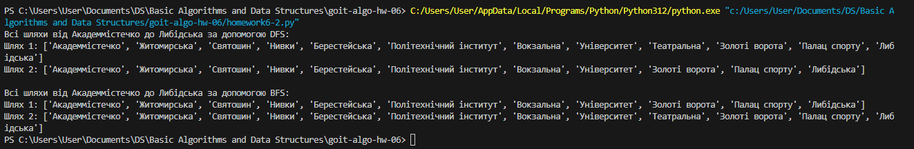

# goit-algo-hw-06

DFS (Пошук у глибину):
Знайдено два шляхи:
Шлях 1: ['Академмістечко', 'Житомирська', 'Святошин', 'Нивки', 'Берестейська', 'Політехнічний інститут', 'Вокзальна', 'Університет', 'Театральна', 'Золоті ворота', 'Палац спорту', 'Либідська']
Шлях 2: ['Академмістечко', 'Житомирська', 'Святошин', 'Нивки', 'Берестейська', 'Політехнічний інститут', 'Вокзальна', 'Університет', 'Золоті ворота', 'Палац спорту', 'Либідська']

BFS (Пошук у ширину):
Знайдено два шляхи:
Шлях 1: ['Академмістечко', 'Житомирська', 'Святошин', 'Нивки', 'Берестейська', 'Політехнічний інститут', 'Вокзальна', 'Університет', 'Золоті ворота', 'Палац спорту', 'Либідська']
Шлях 2: ['Академмістечко', 'Житомирська', 'Святошин', 'Нивки', 'Берестейська', 'Політехнічний інститут', 'Вокзальна', 'Університет', 'Театральна', 'Золоті ворота', 'Палац спорту', 'Либідська']

Однакові шляхи: Другий шлях, знайдений обома алгоритмами, є однаковим. Це пояснюється тим, що BFS, ідучи в ширину, проходить через найближчі станції на кожному рівні, а DFS при певному порядку обходу також може знайти такий же шлях.

Різні шляхи: Перший шлях у DFS відрізняється від першого шляху в BFS тим, що DFS спочатку заглиблюється до станції "Театральна", а потім повертається до "Золотих воріт", тоді як BFS йде прямо до "Золотих воріт", минаючи "Театральну".

DFS: Пошук у глибину йде вглиб першого знайденого маршруту до кінця, перш ніж повернутися і досліджувати інші маршрути. Це призвело до того, що DFS знайшов шлях через "Театральну", хоча це й не найкоротший шлях.

BFS: Пошук у ширину йде рівнями, спочатку досліджуючи всі можливі станції на одному рівні глибини, перш ніж перейти до наступного рівня. Це гарантує знаходження найкоротшого шляху. Таким чином, BFS знайшов прямий шлях через "Золоті ворота", не заходячи спочатку на "Театральну".

Висновок:
BFS завжди знайде найкоротший шлях (у термінах кількості станцій), тому що досліджує всі сусідні вершини на кожному рівні перед тим, як перейти до наступного.
DFS може знайти більш довгі або непрямі шляхи, особливо якщо граф має розгалуження або кілька варіантів маршруту, тому що DFS спочатку досліджує один маршрут до кінця перед тим, як спробувати інші.